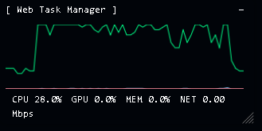
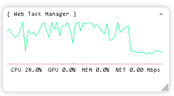

<h1 align="center">🖥️ Web Task Manager</h1>

  <b>by O-TYAN64</b> 
  Lightweight, real-time CPU / GPU / Memory monitor for browsers. 
  軽量でリアルタイムなブラウザ向けタスクマネージャー。

  
  
  

---

## 🌟 Overview / 概要

**Web Task Manager** は、ブラウザ上で CPU / GPU / メモリ使用率を  
リアルタイムに可視化する **Tampermonkey スクリプト** です。  
サイトを問わず動作し、軽量・シンプル・カスタマイズ可能。

---

## 🧩 Features / 機能

| 機能 / Feature | 内容 / Description |
|----------------|--------------------|
| 🧠 CPU / GPU / MEM モニタリング | 各使用率をリアルタイム表示 (30fps) |
| 📈 折れ線グラフ | CPU🟩 / GPU🟦 / MEM🟧 の履歴を描画 |
| 🎨 自動テーマ切替 | 🌙 ダーク / ☀️ ライト |
| 🧱 ドラッグ移動 | ウィンドウを自由に移動 |
| ➖ 最小化ボタン | 小さくまとめて省スペース表示 |
| 💾 状態保存 | `localStorage` にテーマ・位置・最小化状態などを保存 |
| ⚡ 完全ネイティブ実装 | ライブラリ依存なし・軽量・純JS |

---

## 🕹️ Controls / 操作方法

| ボタン | 説明 | Description |
|:--:|:--|:--|
| － | 最小化／復元 | Minimize / Restore |
---

## 💾 Persistent Settings / 状態保存

保存内容はブラウザの `localStorage` に保持され、  
ページ更新後も前回の状態が再現されます。

| Key | 内容 / Description |
|-----|---------------------|
| `dark` | テーマ状態 |
| `pos` | ウィンドウ位置 |
| `hideGraph` | グラフON/OFF |
| `minimized` | 最小化状態 |

---

## 🧠 Installation / インストール方法

1. **[Tampermonkey](https://www.tampermonkey.net/)** をインストール  
2. 「新しいスクリプトをインストール」  
3. **[web_task_manager.user.js](https://raw.githubusercontent.com/O-TYAN64/web-task-manager/main/web-task-manager.user.js)** (install)  
---

## 📷 Screenshots

  
  

---

## ⚙️ Configuration / 設定メモ

- グラフは Canvas ベースで約 30fps 更新  
- GPU名は自動取得（長すぎる場合は自動短縮）  
- 位置・テーマ・グラフ表示状態は自動保存  
- ページごとに独立した設定保持  

---

## 🔮 Future Plans / 今後の予定

- [ ] 実際のCPU/GPU使用率を取得（Performance API対応）  
- [ ] グラフを滑らかに補間するアニメーション化  
- [ ] カスタムカラーテーマ設定  
- [ ] ピン固定（常に最前面表示）  

---

## 🧑‍💻 Author / 作者

**O-TYAN64**  
[GitHub Profile](https://github.com/O-TYAN64)

---

## ⚖️ License

Released under the **MIT License**.  
自由に改変・再配布可能です。クレジットの残存をお願いします。

---

  © 2025 O-TYAN64 — Web Task Manager v3.0

